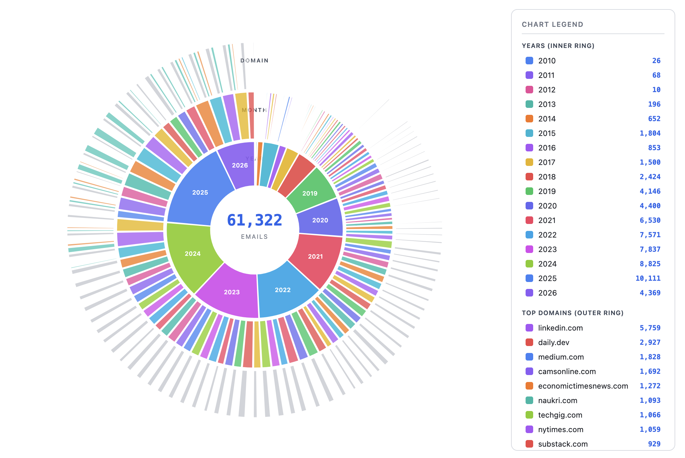
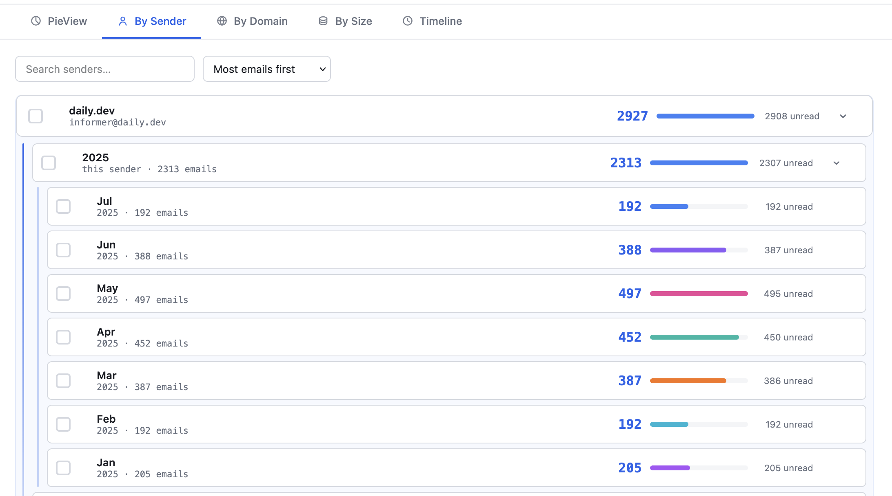
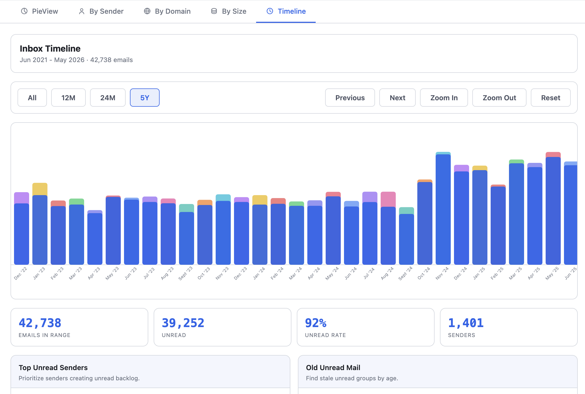

# InboxPie CLI - Visualize and clean your inbox. Private, local, open source.

The CLI version of InboxPie is a local-first Python command-line tool for macOS that scans Apple Mail metadata and generates audit analytics compatible with the Thunderbird extension.

Thunderbird users can use the [InboxPie Thunderbird extension](https://github.com/AKSarav/InboxPie/tree/main/THUNDERBIRD) to visualize and clean their inbox.

> We are currently in progress to bring InboxPie to other mailboxes like O365 and other Clients in the near future. If you are interested in helping us with this, please contribute to the project

## Install from PyPI

```bash
pip install inboxpie
```

## Install from Github repo

```bash
cd CLI
python -m venv .venv
source .venv/bin/activate
pip install -e .
```

## Commands

```bash
inboxpie version
inboxpie privacy-settings   # macOS: open Full Disk Access in System Settings
inboxpie scan --source apple-mail [--mode auto|index|emlx] [--mail-root PATH] [--folders "INBOX,Sent"] [--output terminal|csv|json|html|all] [--report-dir DIR] [--privacy]
```

## Full Disk Access (required on macOS)

Reading `~/Library/Mail/` requires **Full Disk Access** for the **app where you run the command** — Terminal, iTerm, Cursor, VS Code, etc. — **not** `inboxpie` and **not** Python.

**First-time setup:**

1. Run `inboxpie privacy-settings` to open **System Settings → Privacy & Security → Full Disk Access**.
2. Enable the app InboxPie detects (e.g. **Cursor** if you use Cursor’s terminal). If detection fails, match the app in your menu bar / window title.
3. **Quit that app completely** (Cmd+Q), reopen it, then scan again.

If a scan fails for permissions, `inboxpie scan` prints which app to enable and reminds you to run `inboxpie privacy-settings`.

- **`auto` / `index`**: need FDA for the Envelope Index.
- **`emlx`**: also needs FDA to walk `~/Library/Mail/` on recent macOS versions.

**Security:** FDA applies to the **whole host app**, not only inboxpie. Any command run in that same terminal can read protected folders until you revoke access. Use a terminal you trust, toggle FDA off when finished

## Scan strategy

Apple Mail stores messages in two places that InboxPie can read locally:

| Layer | What it is | InboxPie mode |
|---|---|---|
| **Envelope Index** | SQLite catalog Mail.app uses for search, folders, and flags | `--mode index` |
| **`.emlx` files** | One file per message under `~/Library/Mail/V*/` | `--mode emlx` |

**Default: `--mode auto`**

1. Read the **Envelope Index** first — fast, and aligned with what Mail.app shows.
2. If the index is unavailable (permissions, missing file, schema mismatch), **fall back to `.emlx`** automatically.

### Scan modes

- **`auto`** (default): Envelope Index first, `.emlx` fallback.
- **`index`**: Envelope Index only. Fails with a clear error if Full Disk Access is missing or the schema is not recognized.
- **`emlx`**: Walk `.emlx` files only. Slower, but useful when you want filesystem-level scanning or the index is unavailable.

Both engines read **metadata only** — headers, plist flags, dates, folder paths, and size. Message bodies are never parsed or stored.

## Outputs

- Terminal summary (`rich` tables)
- CSV report: `mail-audit-report.csv`
- JSON report: `mail-audit-report.json`
- Static HTML report: `--report-dir/inboxpie-report.html`

The HTML report mirrors the Thunderbird extension dashboard: PieView, sender/domain drill-down, timeline insights, and **selection + review**. Use checkboxes or **Select** buttons to build a set, then open **Review Selected** to search and inspect subject, sender, folder, date, and size. Export the selection as CSV. There are no move actions in the CLI report (read-only).





## Examples

```bash
# macOS first-time: open Full Disk Access, enable your terminal app, quit & reopen it
inboxpie privacy-settings

# Default scan (index with emlx fallback) and terminal summary
inboxpie scan --source apple-mail

# Scan only Inbox and Sent folders, emit all report formats
inboxpie scan --folders "INBOX,Sent" --output all --report-dir ./reports

# Force Envelope Index only (faster when FDA is granted)
inboxpie scan --mode index --output json

# Force filesystem scan
inboxpie scan --mode emlx --output all

# Privacy mode (mask emails in terminal/HTML)
inboxpie scan --privacy --output all --report-dir ./reports
```

## Privacy

InboxPie CLI reads only message **metadata** (sender, subject, date, folder, read status, size). It never reads or stores email body content. See [PRIVACY.md](PRIVACY.md) for details.

## Development

```bash
pip install -e ".[dev]"
pytest
```
