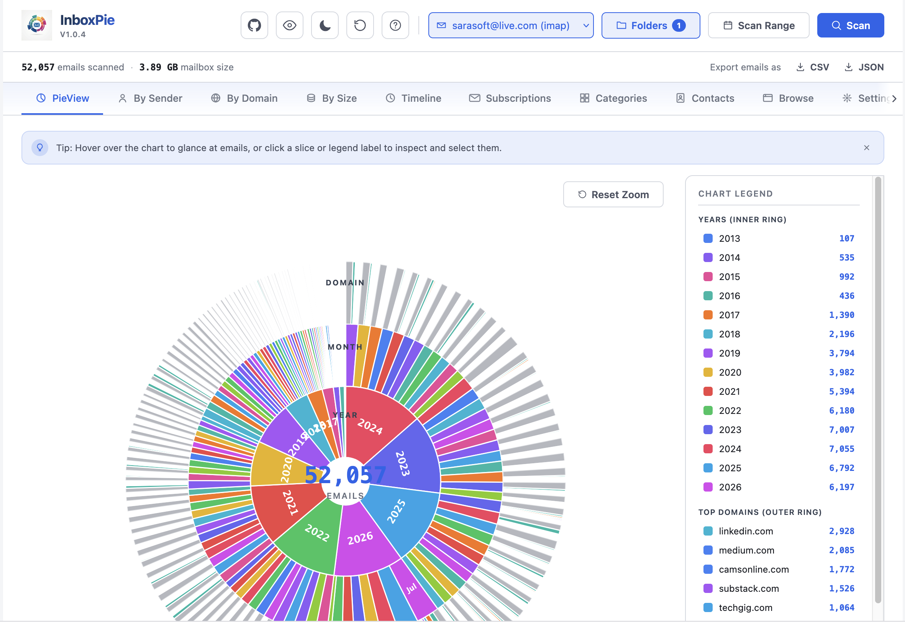
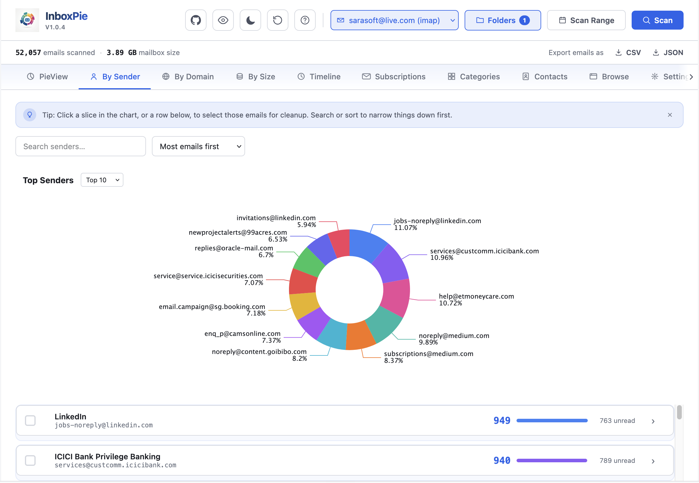
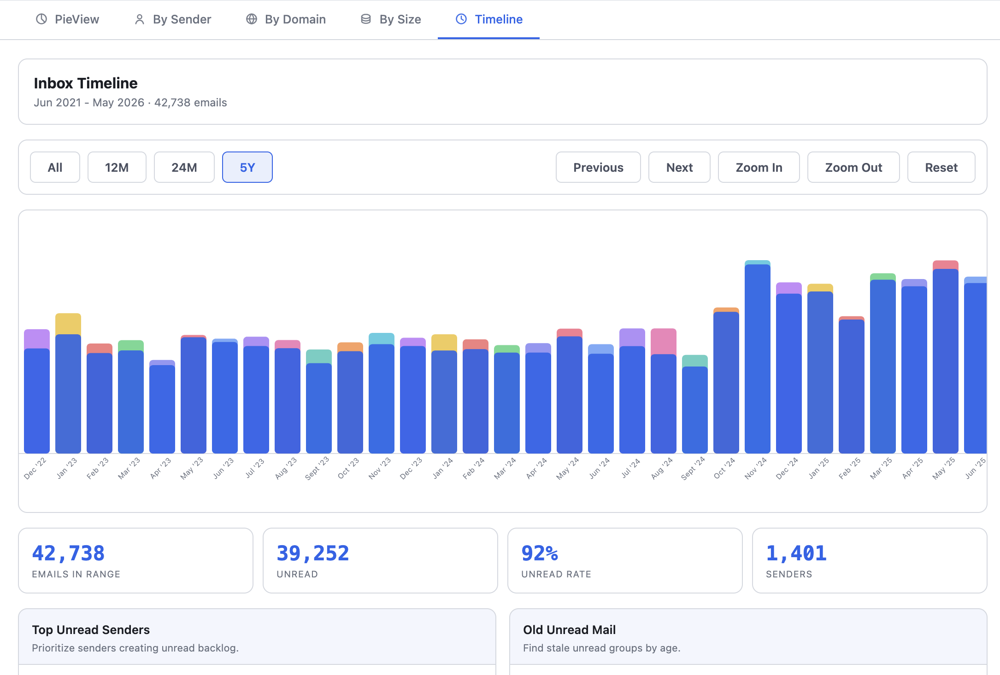
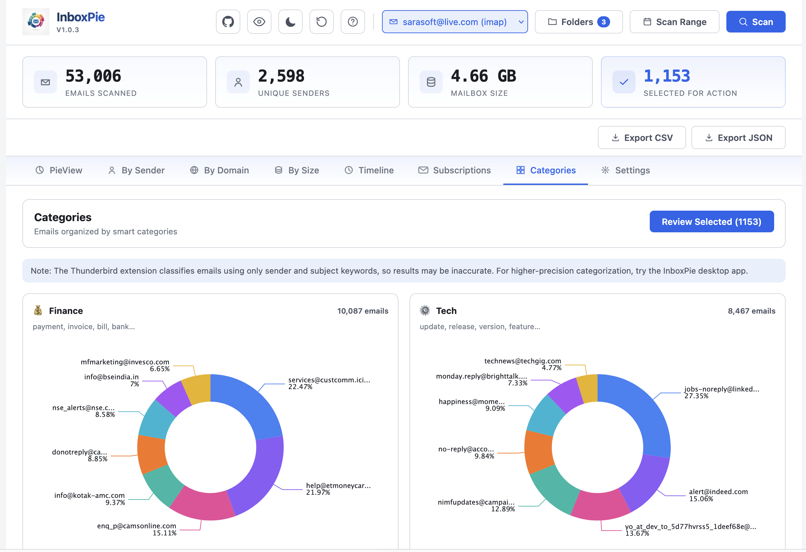
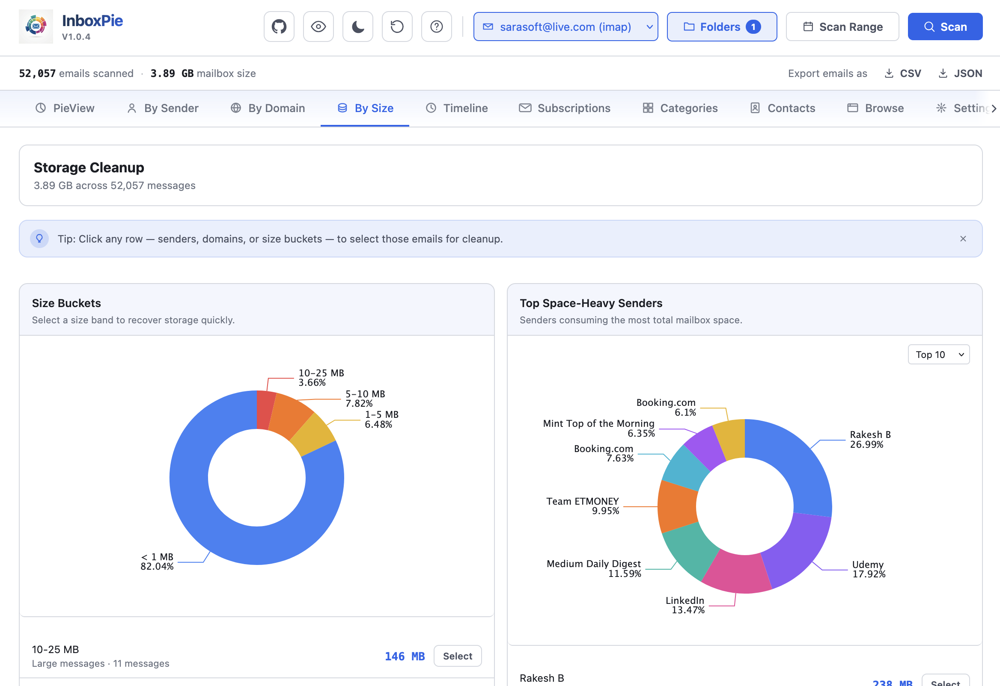
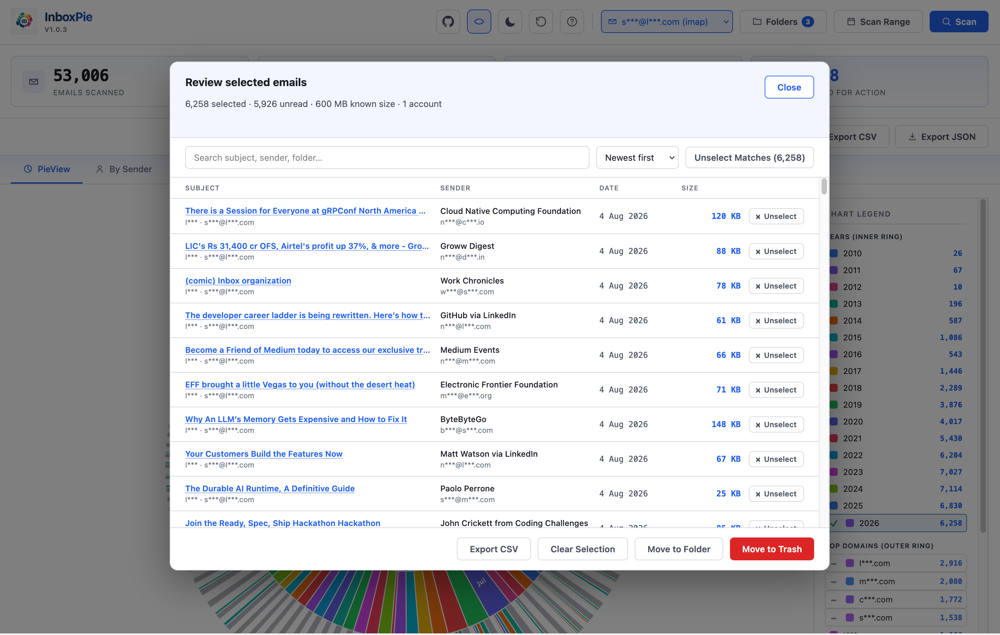

# InboxPie — Privacy First Thunderbird Email Analytics and Cleanup

InboxPie extension is a local-first Thunderbird extension for visualizing and cleaning up your business email inbox. 

It scans message metadata, turns the inbox into visual summaries, and lets you review selected messages before you can take the call to action to move them to Trash or another folder. 

No Personal Data is collected or stored. It is a local-first extension that runs inside Thunderbird with no external service, API key, telemetry, or cloud upload.








The extension is designed for people who want to answer questions like:

- Which senders or domains create most of my mail?
- Which unread messages are old or noisy?
- Which messages take the most storage?
- What exactly am I about to move before I take action?

## Features

- **PieView** — Interactive sunburst visualization by Year -> Month -> Domain. Click chart segments to drill down and hover for details. Sunburst legend is now clickable to add matching messages to your selection.
- **By Sender** — Rank senders by volume, expand a sender into years and months, then select specific groups for cleanup. Clicking a chart slice toggles selection for that sender directly.
- **By Domain** — Group messages by sender domain and expand each domain to inspect individual senders. Clicking a chart slice toggles selection for that domain directly.
- **By Size** — Find storage-heavy messages, senders, domains, and size buckets.
- **Timeline** — Explore message volume over time with range controls, zoom, month selection, and cleanup insight cards.
- **Categories** — User-defined message categories for organizing and filtering your inbox.
- **Subscriptions** — Manage subscription sources and view subscription-related messages.
- **Contacts** — Every unique sender as a searchable, A–Z indexed contact directory (name, email, domain, email count, last contacted). Export the list as CSV or JSON.
- **Browse** — A flat, searchable table of every scanned email with a checkbox on each row, virtually scrolled so it stays fast even across a full mailbox. Checking a row here behaves exactly like selecting from any other view.
- **Settings** — Customize extension behavior, theme preferences, and scan options.
- **Selection engine** — A shared selection follows you across every view. A floating pill in the bottom-right corner tracks the live count, bumps on change, and gives one-click access to Review or Reset.
- **Review Selected** — Before moving anything, review every selected message (no cap — virtually scrolled) in a checkbox-driven table with subject, sender, folder, account, date, and size. Search or sort, then use **Exclude checked** / **Keep only checked** to fine-tune, click a subject to open it in Thunderbird, or export the selection as CSV.
- **Move to Trash / Move to Folder** — Act on exactly what's checked, with a live in-modal progress ring so you can see the batch move happen in real time.
- **Privacy Mode** — Toggle email masking to hide emails and domains on-screen for screenshots, demos, or screen sharing (e.g., `john@example.com` → `j***@l***.com`). Exports always use real addresses.
- **Folder Selection** — Choose exactly which folders and subfolders to scan from your real mailbox tree. Selection persists across sessions.
- **Multi-account support** — Scan all connected accounts or focus on one account.
- **Local-first** — Runs inside Thunderbird with no external service, API key, telemetry, or cloud upload.

## Privacy

InboxPie processes mailbox information locally in Thunderbird.

- It does **not** send mailbox data to any server.
- It does **not** use analytics or telemetry.
- It does **not** read or display full email bodies.
- It uses message metadata needed for organization: sender, subject, date, folder, account, read status, tags, and size when Thunderbird exposes it.
- Selected messages are moved only after the user reviews and confirms the action.

> Why should you believe this ? - that's why InboxPie is OpenSource and you can review the code yourself.

## Permissions

| Permission | Why it is needed |
|---|---|
| `accountsRead` | List Thunderbird accounts and folders so the user can choose what to scan and where to move messages. |
| `messagesRead` | Read message metadata for charts, tables, search, review, and cleanup insights. |
| `messagesMove` | Move reviewed messages to a user-selected folder. |
| `messagesDelete` | Move reviewed messages to Trash. The extension does not permanently delete messages. |

## Usage

1. Click the **InboxPie** toolbar icon in Thunderbird.
2. Choose an account or keep **All Accounts** selected.
3. Click **Scan Mailbox**.
4. Explore the views:
   - **PieView** for a visual year/month/domain overview.
   - **By Sender** to find and drill into noisy senders.
   - **By Domain** to identify domains producing the most mail.
   - **By Size** to recover mailbox storage.
   - **Timeline** to review message volume and cleanup opportunities over time.
   - **Browse** to search and check emails individually, with no aggregation in the way.
5. Select rows, chart slices, or insight groups. A floating pill appears in the bottom-right corner showing your live selection count.
6. Click the floating pill (or its **Review** button) to open **Review Selected**.
7. Search or sort, check/uncheck individual messages, use **Exclude checked** / **Keep only checked** to fine-tune, click a subject to open it in Thunderbird, export to CSV if needed, then choose **Move to Trash** or **Move to Folder** — watch the live progress ring as it moves.

**Privacy Mode:** Click the eye icon in the header to toggle on-screen email and domain masking — useful for screenshots or screen sharing. CSV exports are never masked.

## Folder Scanning

Click the **Folders** button in the header to load your mailbox tree and choose which folders and subfolders to scan.

- Folders are loaded from Thunderbird when you open the dropdown.
- Subfolders appear indented under their parent folders.
- Defaults to just the Inbox (and its subfolders).
- Your selection is saved and persists across sessions.
- Use **All** or **None** for quick bulk selection.

## Changelog

### 1.0.4

**New: Contacts and Browse pages**

- **Contacts** — every unique sender aggregated into a searchable, A–Z indexed directory. Export as CSV or JSON.
- **Browse** — a flat, virtually-scrolled, searchable table of every scanned email with a checkbox on each row, for manual one-by-one curation without going through an aggregated view.

**Selection engine overhaul**

- Review Selected now uses real per-row checkboxes (plus a header select-all) instead of a per-row Unselect button, and is virtually scrolled — no more 500-message display cap.
- New **Exclude checked** / **Keep only checked** actions, plus a built-in guided-tour help button explaining the screen.
- Move to Folder / Move to Trash now act on exactly the checked+matched set, with counts on the buttons that always match reality.
- Move to Trash / Move to Folder show a live, in-modal circular progress ring (driven by real batch-progress events from the background script) instead of a separate top-of-page bar.
- A floating selection pill (bottom-right, follows you across every view) replaced the old static "Selected for Action" stat card — it live-updates, bumps on change, and opens Review or clears the selection in one click.
- Clicking a slice in By Sender / By Domain now toggles selection for that sender/domain directly (matching how Categories already worked), independent of the search box.

**Other improvements**

- Toolbar icon now displays correctly (was silently falling back to the default puzzle-piece icon).
- Per-page dismissible tip banners on PieView, By Sender, By Domain, By Size, Timeline, Contacts, and Browse.
- Tab bar is now horizontally scrollable with fade-edge arrows once it overflows a narrow window, instead of squeezing/wrapping.
- PieView's sunburst chart resized to ~80% for better proportion.
- Export CSV / Export JSON restyled as plain text links.
- Default folder scan selection changed from Inbox + Sent + Archives + Junk to **Inbox only**.
- Fixed: Folders/Scan Range buttons not visually showing their active state.
- Fixed: a stale folder count badge after switching accounts, and a false "select at least one folder" prompt that could appear despite a valid default selection.
- New optional "Support InboxPie" popover (Star on GitHub / Sponsor / Write a Review), shown once ~30 seconds after your first scan, dismissible for the session.

### 1.0.3

**New Views and Enhanced Visualization** (`0813caf`)

- Added three new dashboard views: **Categories** for user-defined message categorization, **Subscriptions** for managing subscription sources, and **Settings** for customizing extension behavior and preferences.
- Migrated all charting from hand-rolled SVG bar charts to Apache ECharts for improved performance, interactivity, and maintainability.
- Enhanced **PieView** legend with interactive click-to-select functionality for matching messages.
- Improved security: all dynamic HTML rendering in dashboard.js now routed through a single `setSafeHtml()` sanitizing helper to eliminate unsafe innerHTML assignments.
- All permissions remain unchanged and continue to request only metadata access (no message bodies).

### 1.0.2

**Private Mode Enhancement and Bug Fixes** (`6263f5e`)

- Extended privacy masking to domains, account names, and PieView detail panels.
- Fixed stale unmasked content when toggling privacy mode on PieView drill-down.
- Fixed PieView domain detail **Select** button via delegated click handling.

**Open Emails with Hyperlink** (`be4b585`)

- Review Selected subjects are clickable links that open the message in a Thunderbird tab.
- Folder picker now loads your real mailbox tree, including subfolders, instead of only standard folder types.
- Scan uses the exact folders you select, not just folder-type filters.
- Account change resets the dashboard and refreshes the folder list when the picker is open.

## Development Installation

1. Open Thunderbird.
2. Go to **Tools -> Developer Tools -> Debug Add-ons** or open `about:debugging`.
3. Click **Load Temporary Add-on...**.
4. Select this repository's `manifest.json`.
5. Click the InboxPie toolbar icon to open the dashboard.

Temporary add-ons are removed when Thunderbird restarts.

## InboxPie CLI

See the [CLI README](../CLI/README.md) for the Python command-line tool that scans Apple Mail.

## Packaging

For a release build, package only the active extension files:

```bash
zip -r app@inboxpie.com.xpi manifest.json background.js dashboard/ icons/
```

Do not include development notes, old prototype files, screenshots, or unrelated workspace files in the XPI.

## Requirements

- Thunderbird 115 or later.
- Works with Thunderbird accounts supported by the MailExtension APIs, including IMAP, POP3, and local folders.

## Notes for Add-on Review

- No remote JavaScript or third-party runtime libraries are used. The bundled `dashboard/echarts.min.js` is a local, unmodified copy of Apache ECharts — no CDN, no remote fetch.
- No external network calls are made automatically by the extension. The optional "Support InboxPie" popover contains three plain `<a target="_blank" rel="noopener noreferrer">` links (GitHub, Ko-fi, addons.thunderbird.net) that only navigate when the user explicitly clicks them — the extension never calls out on its own.
- The extension uses Thunderbird MailExtension APIs and stores only local UI preferences in `localStorage`: theme, privacy mask toggle, folder scan selection, dismissed per-page tip banners, and whether the support popover was dismissed for the session (`sessionStorage`).
- Opening a message from Review Selected or Browse uses `messageDisplay.open` on user click only; the extension does not read message bodies.
- The review screen is intentionally placed before bulk actions so users can inspect message metadata before moving messages.
- No new permissions were added in this release; the four requested permissions are unchanged from prior versions.

## Open Source ❤️

InboxPie is available as open source under the MIT License. See the [LICENSE](LICENSE) file for details.

## Creator and Contact

InboxPie is created and maintained by AKSarav. Follow me on LinkedIn [@aksarav](https://www.linkedin.com/in/aksarav/) 
