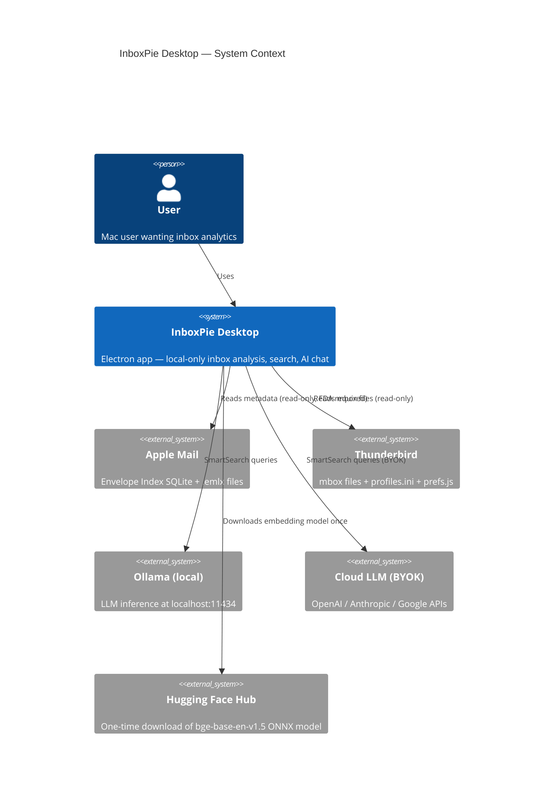
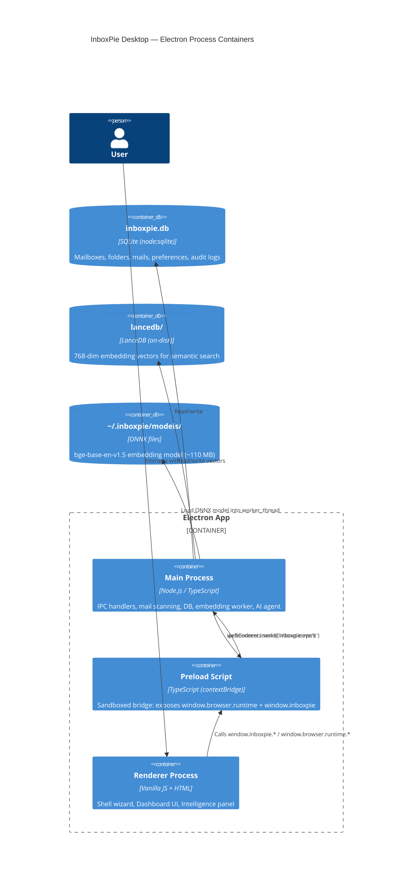
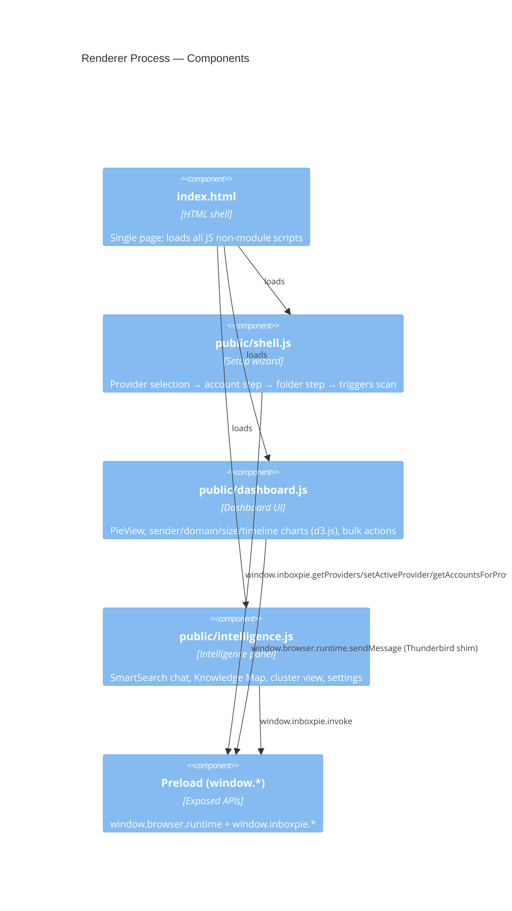
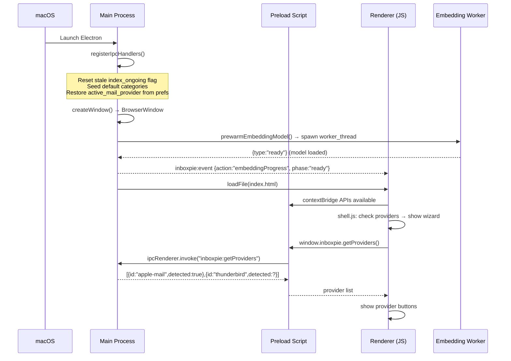
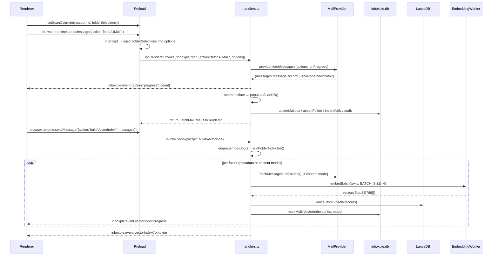
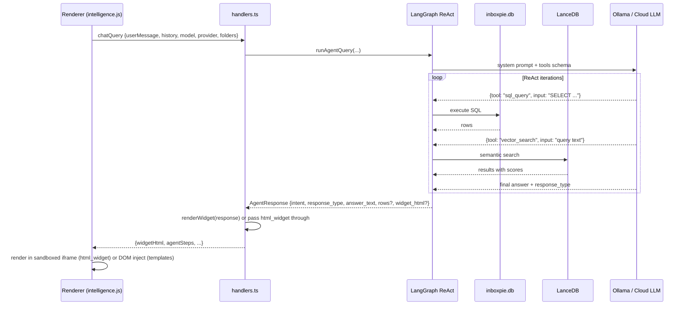

# InboxPie Desktop — Architecture Reference

> Keep this file up to date whenever a new module, interface, provider, IPC action, or DB table is added.

---

## 1. Overview

InboxPie Desktop is a privacy-first macOS Electron app that scans local mail clients
(Apple Mail, Thunderbird), stores metadata in local SQLite and vector databases, and
provides a SmartSearch AI interface — all without any data leaving the device.

**Three Electron processes collaborate:**

| Process | Runtime | Role |
|---------|---------|------|
| Main | Node.js | File I/O, SQLite, IPC routing, background jobs |
| Preload | Sandboxed Node | Bridge; exposes typed APIs to renderer |
| Renderer | Browser (no Node) | All UI — vanilla JS, no framework |

---

## 2. C4 Level 1 — System Context



---

## 3. C4 Level 2 — Containers



---

## 4. C4 Level 3 — Main Process Components

```mermaid
C4Component
  title Main Process — Components

  Component(entrypoint, "index.ts", "Electron entry", "Creates BrowserWindow, registers IPC, prewarms embedding model")

  Component_Boundary(ipc, "IPC Layer") {
    Component(handlers, "ipc/handlers.ts", "ipcMain", "Routes all RPC actions; owns index job queue and scan-DB writer")
  }

  Component_Boundary(mail, "Mail Layer") {
    Component(registry, "mail/index.ts", "MailProviderRegistry", "In-memory registry; tracks active provider")
    Component(providerIface, "mail/provider.ts", "MailProvider interface", "Contract: getAccounts, getFolders, fetchMessages, delete, move, open")
    Component(appleMail, "mail/apple-mail.ts", "AppleMailProvider", "Reads Envelope Index (SQLite) + .emlx files; FDA-gated")
    Component(thunderbird, "mail/thunderbird.ts", "ThunderbirdProvider", "Parses profiles.ini, prefs.js; streams mbox files in 256 KB chunks")
    Component(emailParser, "mail/email-parser.ts", "MIME utilities", "extractBodyPreview: headers + text/plain only, skips attachments")
  }

  Component_Boundary(db, "Database Layer") {
    Component(inboxpieDb, "db/inboxpie-db.ts", "InboxPieDB (node:sqlite)", "Mailboxes, folders, mails, preferences, audit tables")
    Component(lanceStore, "db/lance-store.ts", "LanceStore (LanceDB)", "Vector upsert, hybrid search, folder stats")
    Component(enrichment, "db/enrichment.ts", "EnrichmentDB", "Sender/domain graph for Knowledge Map")
  }

  Component_Boundary(agent, "AI / Embedding Layer") {
    Component(embeddings, "agent/embeddings.ts", "Embedding bridge", "Delegates ONNX inference to worker_thread; never blocks main event loop")
    Component(embWorker, "agent/embedding-worker.ts", "worker_thread", "Runs bge-base-en-v1.5 via Transformers.js ONNX runtime")
    Component(indexer, "agent/indexer.ts", "buildVectorIndex", "Converts MessageRecords to text, batches embeddings (BATCH_SIZE=4), upserts LanceDB")
    Component(nlpAgent, "agent/nlp-agent.ts", "NLP Agent", "checkOllama, shared types, cloud provider check")
    Component(langgraph, "agent/langgraph-agent.ts", "LangGraph ReAct", "Tool-calling agent: SQL→inboxpie.db, vector search→LanceDB, HTML widget generation")
    Component(widgetRenderer, "agent/widget-renderer.ts", "Widget renderer", "Server-side template rendering for agent responses")
  }

  Rel(entrypoint, handlers, "registerIpcHandlers()")
  Rel(entrypoint, embeddings, "prewarmEmbeddingModel()")
  Rel(handlers, registry, "mailProviders.getActive()")
  Rel(registry, appleMail, "AppleMailProvider instance")
  Rel(registry, thunderbird, "ThunderbirdProvider instance")
  Rel(appleMail, emailParser, "extractBodyPreview() when includeBody=true")
  Rel(thunderbird, emailParser, "extractBodyPreview() when includeBody=true")
  Rel(handlers, inboxpieDb, "populateScanDB, preferences, audit")
  Rel(handlers, lanceStore, "vector stats, search, delete")
  Rel(handlers, indexer, "buildVectorIndex()")
  Rel(handlers, langgraph, "runAgentQuery()")
  Rel(indexer, embeddings, "embedBatch(texts)")
  Rel(indexer, lanceStore, "upsert vectors")
  Rel(langgraph, inboxpieDb, "SQL queries via apple-mail-db.ts")
  Rel(langgraph, lanceStore, "semantic search")
  Rel(embeddings, embWorker, "worker_threads message passing")
```

---

## 5. C4 Level 3 — Renderer Components



---

## 6. Key Class / Interface Map

### 6.1 MailProvider Interface (`mail/provider.ts`)

```
MailProvider (interface)
├── id: string                     — unique provider key ("apple-mail" | "thunderbird")
├── name: string                   — display name
│
├── Discovery
│   ├── getAccounts(): Promise<MailAccount[]>
│   └── getFolders(accountId?): Promise<FolderInfo[]>
│
├── Scan
│   └── fetchMessages(options, onProgress?): Promise<FetchMailResult>
│
└── Actions (return success:false when unimplemented)
    ├── deleteMessages(ids)
    ├── moveMessagesToFolder(ids, accountId, folderPath, onProgress?)
    └── openMessage(id)

MailProviderRegistry (interface)
├── list(): ReadonlyArray<{id, name}>
├── get(id): MailProvider | undefined
├── getActive(): MailProvider
└── setActive(id): void
```

### 6.2 AppleMailProvider (`mail/apple-mail.ts`)

```
AppleMailProvider implements MailProvider
│
├── getAccounts()
│   └── reads Envelope Index → ZACCOUNT / ZACCOUNTPROPERTY tables
│       falls back to plist parsing for UUID→name mapping
│
├── getFolders(accountId?)
│   ├── queries mailboxes table in Envelope Index
│   └── merges with inboxpieDb scan/index stats
│
└── fetchMessages(options)
    ├── primary: scanEnvelopeIndexMessages()
    │   └── SELECT … CAST(date_sent AS REAL) … FROM messages JOIN subjects JOIN addresses JOIN mailboxes
    │       throws FDA_ERROR on EPERM/EACCES
    └── fallback: .emlx file scanning (when Envelope Index unavailable)

Key helpers:
  openEnvelopeIndex(path)   — copies DB to temp file, opens with DatabaseSync
  parseMailboxUrl(url)      — extracts UUID + folderPath from imap://... URLs
  unixSecsToDateParts(ts)   — ts → {date, year, month, monthName}
  scanEnvelopeIndexMessages — main query; CAST prevents node:sqlite BigInt overflow
```

### 6.3 ThunderbirdProvider (`mail/thunderbird.ts`)

```
ThunderbirdProvider implements MailProvider
│
├── getAccounts()
│   ├── detectThunderbirdProfile()
│   │   └── reads ~/Library/Thunderbird/profiles.ini
│   │       priority: [InstallXXXX] Default= (Tb 78+) → [ProfileN] Default=1 → first with prefs.js
│   └── parsePrefsJs(profileDir)
│       └── extracts mail.account.* / mail.server.* keys → TbAccountInfo[]
│
├── getFolders(accountId?)
│   ├── walks mbox directory tree for each account's mail directory
│   │   (files with no extension and no .msf suffix are mbox folders)
│   │   (FolderName.sbd/ subdirectories = subfolder containers)
│   └── countMboxMessages(path)
│       ├── skips files > 256 MB → returns undefined (shows "—")
│       └── reads in 64 KB chunks, counts "\nFrom " separators
│
└── fetchMessages(options)
    └── scanMboxFile(path, folderName, accountId, includeBody)
        ├── streams in 256 KB chunks via fs.createReadStream
        ├── splits on "\nFrom " with 5-byte cross-chunk overlap
        ├── when includeBody=false: buffers headers only (until \n\n), counts body bytes
        └── when includeBody=true: buffers full message for body preview extraction

Key helpers:
  parseMboxMessage(chunk, idx, …, declaredSize?)   — RFC 2822 parse; size=declaredSize when headers-only
  findHeaderBoundary(buf)                          — returns offset after \n\n or \r\n\r\n
  extractBodyPreview(messageBytes)                 — text/plain or text/html only; skips attachments
```

### 6.4 InboxPieDB (`db/inboxpie-db.ts`)

```
InboxPieDB  (singleton: inboxPieDb)
Location: ~/.inboxpie/inboxpie.db

Tables:
  mailboxes     id(TEXT PK), name, source_db_path, apple_id, mail_provider, created_at, updated_at
                id format: "am_<uuid>" (Apple Mail) | "tb_<serverKey>" (Thunderbird)
                apple_id: UUID only for Apple Mail; NULL for Thunderbird
  folders       id(INT PK), mailbox_id(FK), name, indexed, read_mode, updated_at
                UNIQUE(mailbox_id, name)
  mails         id(TEXT PK), mailbox_id(FK), folder_id(FK), sender, domain, size,
                subject, subject_entities(JSON), body_entities(JSON),
                indexed, indexed_meta, indexed_body, created_at, updated_at
  preferences   key(TEXT PK), value, updated_at
  categories    name(TEXT PK), keywords(JSON), icon, builtin, created_at
  scan_audit    id, mailbox_id, folder_id, status, mail_count, error, started_at, completed_at
  index_audit   id, mailbox_id, folders(JSON), status, indexed_count, failed_count, error, …

Key methods:
  upsertMailbox(id, name, sourceDbPath?, mailProvider?)
  upsertFolder(mailboxId, name) → folderId
  insertMails(inserts[])       → inserted count (INSERT OR IGNORE)
  getFolderStats()             → per-folder scan+index counts
  getFolderReadModes(folders)  → {folderName: "metadata"|"content"}
  setFolderReadMode(folder, mode)
  markMailsVectorIndexed(ids, mode)
  getPreference(key, default)
  setPreference(key, value)
  startScanAudit / completeScanAudit / failScanAudit
  startIndexAudit / completeIndexAudit / failIndexAudit
  getCategories / upsertCategory / deleteCategory / seedDefaultCategories
  resetAllData()               → wipes mails, folders, mailboxes (not preferences)
```

### 6.5 LanceStore (`db/lance-store.ts`)

```
LanceStore  (singleton: lanceStore)
Location: ~/.inboxpie/lancedb/   table: "emails"

Schema (LanceEmailRecord):
  id, vector(float32[768]), subject, sender_email, sender_name,
  domain, folder, folder_type, date_unix, year, is_read, size, text_indexed

Key methods:
  upsert(records[])             — insert or overwrite by id
  search(queryVec, opts)        — ANN search + optional filters (folder, domain, year range)
  getAllRows()                  — full table scan (for cluster classification)
  getStats()                   → {total: number}
  getFolderStats()             → per-folder counts
  getFolderBreakdown()         → detail breakdown
  deleteByFolders(names[])     → remove all vectors for named folders
  reset()                       — drop and recreate table
```

### 6.6 Embedding Pipeline (`agent/embeddings.ts` + `agent/embedding-worker.ts`)

```
Main Process                           worker_thread
─────────────────────────────────────  ──────────────────────────────
embeddings.ts                          embedding-worker.ts
│                                      │
├── prewarmEmbeddingModel()            ├── loads Xenova/bge-base-en-v1.5
│   └── spawns worker, waits "ready"  │   via @huggingface/transformers
│                                      │   (ONNX runtime, fully offline)
├── embedBatch(texts[])                │
│   ├── sends {type:"embed", id, texts}│
│   └── returns Promise<number[][]>   ├── on "embed": runs feature-extraction
│       resolved on "result" message  │   sends {type:"result", id, vectors}
│                                      │
└── terminateEmbeddingWorker()        └── on "terminate": worker.terminate()

Model: Xenova/bge-base-en-v1.5  (768-dim, ~110 MB, cached at ~/.inboxpie/models/)
Batch size: 4 texts per call  (prevents OOM; ~200-500ms each)
Sequential: embedBatch called one at a time in indexer (Promise.all was found to OOM)
```

### 6.7 LangGraph Agent (`agent/langgraph-agent.ts`)

```
runAgentQuery(userMessage, history, model, folders, onEvent, mode, signal, provider, apiKey)
│
├── Tools available to agent:
│   ├── sql_query(sql)         — runs against inboxpie.db via apple-mail-db.ts
│   ├── vector_search(query)   — semantic search in LanceDB
│   └── html_widget(html)      — model authors raw HTML; rendered in sandboxed iframe
│
├── LLM providers:
│   ├── ollama (default)       — localhost:11434, no key required
│   ├── openai                 — key encrypted with safeStorage
│   ├── anthropic              — key encrypted with safeStorage
│   └── google                 — key encrypted with safeStorage
│
└── Response types:
    text | stat_card | bar_chart | data_table | html_widget
    → widgetRenderer.renderWidget() produces final HTML for stat/bar/table
    → html_widget: model HTML passed through → sandboxed iframe in renderer
```

---

## 7. IPC Surface

### 7.1 Channels

| Channel | Direction | Purpose |
|---------|-----------|---------|
| `inboxpie:rpc` | Renderer → Main | All request/response actions (single handler) |
| `inboxpie:event` | Main → Renderer | Push events: progress, vector index updates, enrichment |
| `inboxpie:openPrivacySettings` | Renderer → Main | Open macOS FDA settings |
| `inboxpie:getProviders` | Renderer → Main | List registered mail providers with detection status |

### 7.2 RPC Actions (inboxpie:rpc)

**Discovery**
- `getAccounts` → `MailAccount[]`
- `listFoldersForScan` → `FolderInfo[]` with DB scan/index status merged
- `listFolders` → flat folder list for SmartSearch folder picker
- `getAccountsForProvider(providerId)` → accounts without changing active provider
- `getFoldersForAccount(providerId, accountId)` → folders without changing active provider

**Provider management**
- `setActiveProvider(providerId)` — persists to preferences table

**Scan**
- `fetchAllMail(options)` → scan + immediately calls `populateScanDB` via setImmediate

**Actions**
- `deleteMessages(ids)` / `moveMessagesToFolder(ids, accountId, folderPath)` / `openMessage(id)`

**Vector index**
- `buildVectorIndex(messages)` — queued, incremental
- `reindexFolders(folders, incremental)` — queued, from Settings
- `pauseIndexing` / `resumeIndexing` / `getIndexingStatus`
- `resetVectorIndex` / `resetAllData`
- `setFolderReadMode(folder, mode)` — "metadata" | "content"
- `deleteFolders(folders)` — removes vectors + DB rows

**SmartSearch**
- `chatQuery(userMessage, history, model, provider, folders, mode)` → `AgentResponse`
- `cancelChatQuery`
- `checkOllama` → `{available, models[]}`
- `getSetupStatus` — embedding model download %, FDA check, Python check
- `markAppReady`

**AI settings**
- `getAISettings` / `saveAISettings(provider, model, apiKey)` / `clearProviderKey` / `validateProviderKey`

**Intelligence**
- `getSemanticClusters` → keyword-classified counts from LanceDB rows
- `getClusterEmails(label)` → emails for one cluster
- `getFolderStats` / `getIndexingStats` / `getFolderIndexBreakdown`

**Preferences / data**
- `getPreference(key)` / `setPreference(key, value)`
- `getCategories` / `saveCategory` / `deleteCategory`
- `enrichMessages(messages)` → triggers EnrichmentDB populate
- `searchSenders(query)` / `topDomains()`

### 7.3 Push Events (inboxpie:event)

| action | Emitted by | Payload |
|--------|-----------|---------|
| `progress` | scan | `{count}` |
| `deleteProgress` / `moveProgress` | bulk actions | `{moved, total}` |
| `enrichmentStarted` / `enrichmentDone` | enrichment | counts |
| `embeddingProgress` | prewarm | `{phase, pct, error?}` |
| `vectorIndexStarted` | indexer | `{total}` |
| `vectorIndexProgress` | indexer | `{folder, done, total, indexed, errors}` |
| `vectorIndexComplete` | indexer | LanceDB stats |
| `vectorIndexError` | indexer | `{error}` |
| `agentStep` | LangGraph | `{type, label, detail?}` |

---

## 8. App Startup Sequence



---

## 9. Scan → Index Data Flow



---

## 10. SmartSearch Query Flow



---

## 11. Preload Bridge Pattern

The renderer UI (`dashboard.js`) was originally written for Thunderbird's WebExtension API.
The Preload bridges it to Electron IPC without changing dashboard.js:

```
Renderer calls:               Preload translates to:
─────────────────────────     ──────────────────────────────────────────
window.browser.runtime        browserRuntime object (contextBridge)
  .sendMessage(action)    →   ipcRenderer.invoke("inboxpie:rpc", action)
  .onMessage.addListener  →   ipcRenderer.on("inboxpie:event", listener)

window.inboxpie             direct typed methods:
  .getProviders()         →   ipcRenderer.invoke("inboxpie:getProviders")
  .setActiveProvider(id)  →   ipcRenderer.invoke("inboxpie:rpc", {action:"setActiveProvider"})
  .setScanOverride(opts)  →   stores pendingScanOverride (injected into next fetchAllMail)
  .getAccountsForProvider →   ipcRenderer.invoke("inboxpie:rpc", {action:"getAccountsForProvider"})
  .getFoldersForAccount   →   ipcRenderer.invoke("inboxpie:rpc", {action:"getFoldersForAccount"})
```

**Pending scan override pattern**: `shell.js` calls `setScanOverride({accountId, folderSelections})`
before triggering the scan. The preload holds this in memory and injects it into the very next
`fetchAllMail` call, then clears it. This means `dashboard.js` never needs to know about
the wizard; it just fires `fetchAllMail` as usual.

---

## 12. Mail Provider — Scan Modes

| | Apple Mail | Thunderbird |
|--|-----------|------------|
| **Account source** | Envelope Index ZACCOUNT / plist UUIDs | profiles.ini + prefs.js mail.server.* keys |
| **Folder source** | Envelope Index `mailboxes` table | mbox directory walk |
| **Message scan** | SQLite query on `messages` table | Streaming mbox reader (256 KB chunks) |
| **Body indexing** | .emlx file read | Same mbox stream, full buffer |
| **Metadata only** | Headers in SQLite (no disk read) | Header buffer only (stops after `\n\n`) |
| **Large file handling** | N/A (SQLite handles size) | Streams any file size (even >2GB); counts via 64KB chunks |
| **Account ID format** | `am_<uuid>` | `tb_<serverKey>` (e.g., `tb_server2`) |
| **FDA requirement** | Yes — EPERM/EACCES throws `FDA_ERROR` | No (mbox files readable) |
| **Delete/Move** | Stub (not yet implemented) | Stub (not yet implemented) |

---

## 13. Account ID Scheme

Account IDs are prefixed with the provider to enable multi-provider tracking in a single database:

**Apple Mail**: `am_<uuid>`
- Extracted from Envelope Index mailbox URLs (e.g., `imap://XXXXXXXX-XXXX-XXXX-XXXX-XXXXXXXXXXXX@iCloud.com/Inbox`)
- Stored in SQLite `mailboxes.apple_id` as just the UUID (without prefix)
- Stored in `mailboxes.id` as the full prefixed ID

**Thunderbird**: `tb_<serverKey>`
- Server key from `prefs.js` (e.g., `server1`, `server2`, `server3`)
- No separate UUID field — `mailboxes.apple_id` is NULL
- Stored in `mailboxes.id` as the full prefixed ID (e.g., `tb_server2`)

This prefix scheme ensures that:
- Different mail providers can coexist in the same database without ID collisions
- Provider information is encoded in the ID itself (readable in debugs)
- Messages are unambiguously tagged with their origin provider

---

## 14. Index Job Queue

```
indexChain (Promise)    — serialises all embedding jobs (never concurrent)
indexCancelRequested    — checked between BATCH_SIZE batches; allows prompt cancellation
_autoIndexBlocked       — true on every app start; prevents auto-resume of interrupted index
_currentIndexFolders    — tracked for pause/resume; saved to preferences on pause

Job lifecycle:
  enqueueIndexJob(fn)
    → set index_ongoing=yes
    → fn() [runFolderIndexJob]
      → per folder: fetchMessages → embedBatch×N → lanceStore.upsert
    → set index_ongoing=no
    → write index-<timestamp>.json log to userData/logs/

Pause:  set index_paused=yes, save folders to index_paused_folders, set indexCancelRequested=true
Resume: clear pause flags, re-enqueue runFolderIndexJob(savedFolders, incremental=true)
```

---

## 15. Data Paths on Disk

| Path | Contents |
|------|---------|
| `~/.inboxpie/inboxpie.db` | Main SQLite DB (mailboxes, folders, mails, prefs, audit) |
| `~/.inboxpie/lancedb/` | LanceDB vector index |
| `~/.inboxpie/models/` | ONNX embedding model cache (bge-base-en-v1.5) |
| `~/Library/Application Support/InboxPie/logs/` | Per-index JSON logs |
| `~/Library/Mail/` | Apple Mail data (read-only) — requires FDA |
| `~/Library/Thunderbird/` | Thunderbird profiles + mbox files (read-only) |
| `<system tmp>/` | Temporary copy of Envelope Index (opened via `openEnvelopeIndex`) |

---

## 16. Security Model

- `contextIsolation: true`, `nodeIntegration: false`, `sandbox: true` on the renderer
- Renderer has zero Node.js access — all I/O goes through the contextBridge
- API keys (OpenAI / Anthropic / Google) encrypted with Electron `safeStorage` before writing to SQLite; decrypted only in main process for LLM calls; never returned to renderer
- LLM HTML widgets rendered in sandboxed iframes (no `allow-scripts` for model-authored HTML)
- No telemetry, no network calls except: embedding model download (once), LLM inference (user-initiated), Ollama localhost
- Mail body text never stored to disk — body_entities (future NER) is extracted in-memory

---

*Last updated: 2026-06-20 — reflects provider-prefixed account IDs (am_uuid, tb_serverKey), apple_id handling, unlimited mbox streaming, BigInt → BigInt handling for timestamps, full app reload on reset.*
