# InboxPie Agent Architecture

This document explains how the InboxPie email analysis agent works—from query understanding through search, entity extraction, aggregation, and response generation.

## Table of Contents

1. [Overview](#overview)
2. [Query Routing](#query-routing)
3. [Fast Mode: ReAct Loop](#fast-mode-react-loop)
4. [Deep Mode: Aggregation Pipeline](#deep-mode-aggregation-pipeline)
5. [Search & Recall System](#search--recall-system)
6. [Entity Extraction & Graph](#entity-extraction--graph)
7. [Planning Phase](#planning-phase)
8. [Worker Batching & Aggregation](#worker-batching--aggregation)

---

## Overview

The agent has two operational modes:

- **Fast Mode**: Interactive ReAct loop for general questions (semantic search + aggregation stats)
- **Deep Mode**: Map-reduce aggregation pipeline for grouped/analytical queries (pie charts, breakdowns, rankings)

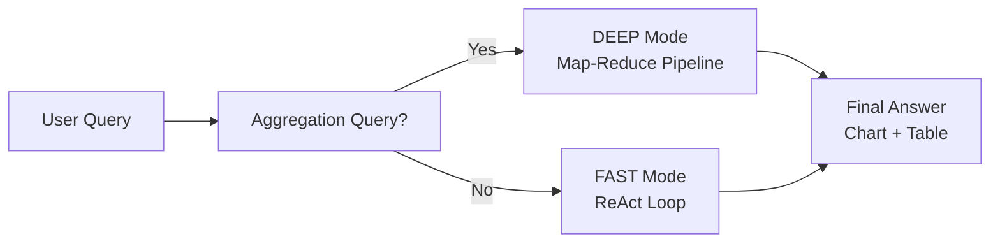

**Query Detection:**
- Keywords: "pie chart", "bar chart", "group by", "grouped", "sum", "total", "count", "breakdown", "distribution"
- If matched AND mode=deep → use aggregation pipeline
- Otherwise → use ReAct loop

---

## Query Routing

The entry point is `runAppleMailAgent()` in `langgraph-agent.ts`:

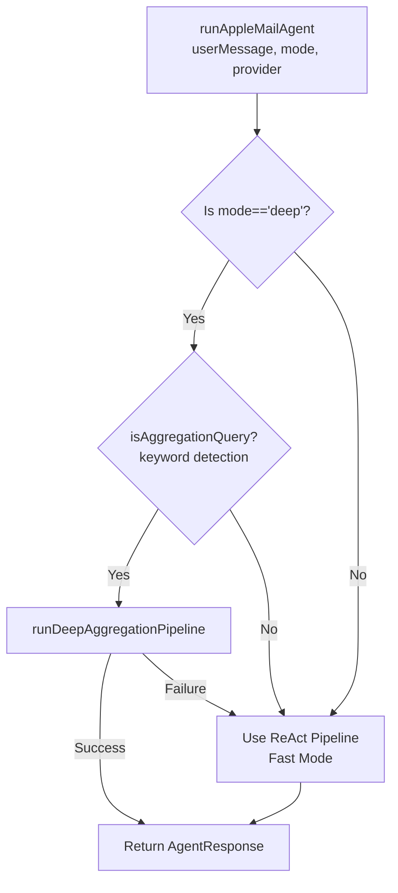

**Parameters:**
- `userMessage`: The user's question
- `mode`: "fast" or "deep" (controls available tools and pipeline choice)
- `model`: LLM identifier (e.g., "gpt-4o-mini", "gemma4:e4b")
- `provider`: "ollama", "anthropic", "openai", etc.

---

## Fast Mode: ReAct Loop

Used for general questions, searches, and interactive queries.

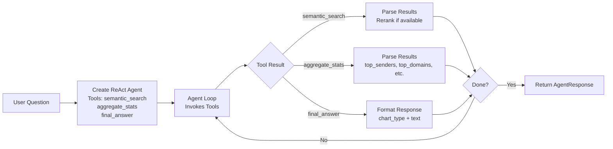

**Tools Available (Fast Mode):**

| Tool | Purpose | Output |
|------|---------|--------|
| `semantic_search` | Find emails by meaning/topic | List of ranked results |
| `aggregate_stats` | Counts, rankings, totals | Structured metadata statistics |
| `final_answer` | Format response (if deep mode) | AgentResponse with chart type |

**Typical Flow:**
1. User: "How many emails from ICICI?"
2. Agent calls `aggregate_stats(mode="top_senders", domain="icicibank.com")`
3. Agent formats response with `final_answer()`

---

## Deep Mode: Aggregation Pipeline

Used for grouping/analytical queries. A **LangGraph StateGraph** processes queries through a linear 5-stage pipeline.

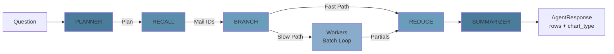

### State Flow

```typescript
type State = {
  question: string              // User query
  plan: Plan | null             // Planner output
  mailIds: string[]             // Recall result
  partials: Aggregate           // Per-entity counts/sums (reducer channel)
  agentSteps: AgentStep[]       // UI event log
  answer: AgentResponse | null  // Final result
}
```

The `partials` field uses a **reducer channel** that automatically merges batch results:

```typescript
const aggregateReducer = (left: Aggregate = {}, right: Aggregate = {}) => {
  // Merge two partial aggregates by key
  // sum += sum, count += count
};
```

---

## Search & Recall System

The **Recall** node performs exhaustive multi-stage search to capture all relevant emails.

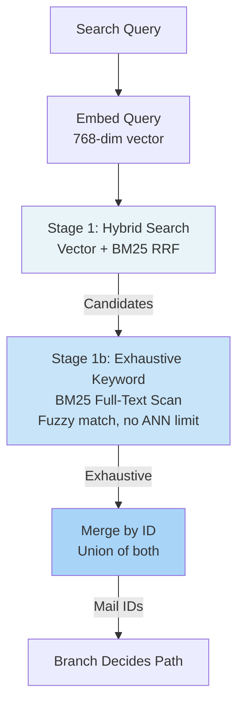

**Three Search Techniques:**

1. **Vector Search (ANN)**
   - Query → 768-dim embedding
   - LanceDB nearest-neighbor search
   - Returns top-K by cosine similarity
   - **Problem:** ANN has implicit top-K limit (silently excludes rank >K results)

2. **Hybrid Search (Vector + BM25)**
   - Combines vector + full-text via Reciprocal Rank Fusion
   - Reranked by cross-encoder if available
   - Still subject to ANN limit

3. **Exhaustive BM25 (No ANN Limit)**
   - Skips vector search entirely
   - Full-text scan over all emails
   - Fuzzy matching (edit distance ≤ 2) for typos
   - **Only runs if planner sets `keyword`**
   - **Guarantees every email with that term is returned**

**For aggregation queries:**
- If keyword="FastTag" → exhaustive search finds ALL FastTag emails (even 500+)
- Merged with hybrid candidates → complete result set
- No data loss from ANN truncation

**Limits:**
- Vector search: 50,000 per request
- Exhaustive search: 50,000 per request
- Both have warnings if capped

---

## Entity Extraction & Graph

Before questions are even asked, emails are scanned to build a knowledge graph.

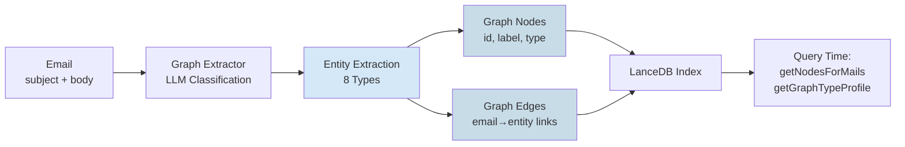

**Entity Taxonomy (8 Types):**

| Type | Examples | Used For |
|------|----------|----------|
| **ORG** | "ICICI Bank", "Amazon", "Netflix" | Grouping by company/institution |
| **PERSON** | "John Doe", "Sarah Smith" | Grouping by person |
| **PRODUCT** | "FASTag", "Credit Card", "Mutual Fund" | Named products/services |
| **PLACE** | "Toll Plaza", "Whitefield Plaza", "NYC" | Geographic grouping |
| **AMOUNT** | "₹500", "$1000", "2.5%" | Monetary/quantity values |
| **DATE** | "Jan 2025", "2025-08-15" | Time-based grouping |
| **EVENT** | "Launch", "Conference", "Anniversary" | Occasions |
| **TOPIC** | General concepts/keywords | Catch-all for non-specific |

**Graph Structure:**
```
graph_nodes:
  id (sha1 hash)
  label (extracted text, e.g. "Toll Plazas (Pan India)")
  type (ORG, PERSON, PLACE, AMOUNT, etc.)
  count (how many emails reference this node)

graph_edges:
  node_id → email_id (which emails mention this entity)
  
graph_mail_nodes:
  email_id → [node_id1, node_id2, ...] (all entities in this email)
```

**At query time:**
- `getNodesForMails(mailIds)` → Returns all entities extracted from those emails
- `getGraphTypeProfile()` → Shows per-type counts + examples for planner context

---

## Planning Phase

The **Planner** converts a natural-language question into a **reduction contract** that the workers execute.

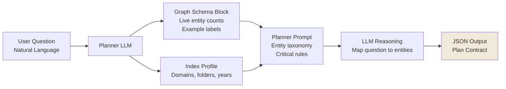

**Plan Contract (`PlanSchema`):**

```typescript
{
  task_summary: string           // e.g., "Aggregate total payments by toll plaza"
  search_query: string           // Natural language recall query
  keyword: string                // Exact term for exhaustive search (e.g., "FASTag")
  filters: {
    year_from?, year_to?         // Date range
    folder_type?                 // inbox, sent, trash, etc.
    domain?                      // Sender domain
  }
  reduce_key: string             // Grouping dimension (e.g., "toll plaza name")
  reduce_key_type: EntityType    // Must be one of 8 types or "BODY"
  measure: "count" | {           // What to measure
    sum: string,                 //   e.g., "payment amount"
    sum_type: EntityType         //   AMOUNT | BODY
  }
  chart_type: "pie_chart" | "bar_chart" | "data_table" | "stat_card"
}
```

**Planner Logic:**

1. **Map question to entity types** (ORG, PLACE, AMOUNT, etc.)
2. **Set keyword** if a named brand/term exists ("FASTag", "ICICI")
3. **Decide measure type:**
   - `measure="count"` → Just count emails per group
   - `measure={sum, sum_type}` → Sum a numeric entity
4. **Detect entity type mismatch:**
   - If `reduce_key_type == sum_type` (both AMOUNT, both PLACE) → can use **fast path**
   - If `reduce_key_type != sum_type` (PLACE vs AMOUNT) → must use **slow path** (read content)

---

## Branch Decision: Fast vs. Slow Path

After recall, the **Branch** node decides whether to aggregate from graph nodes or read email content.

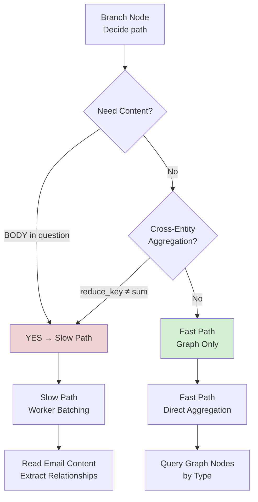

### Fast Path (Graph Only)

Used when both reduce_key and sum are the **same entity type** or **sum is embedded in label**.

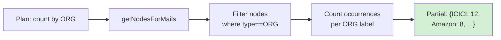

**Example:**
- Q: "How many emails from each domain?"
- Plan: reduce_key_type="ORG", measure="count"
- Fast path: count PLACE nodes → done in <1ms

### Slow Path (Content Reading)

Used when entity types mismatch or measure requires content extraction.

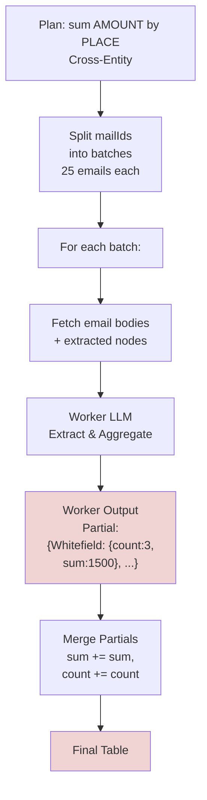

**Worker Prompt:**
- Task contract from planner
- Batch emails (index, body, entities)
- Extract (key, value) per email
- Aggregate WITHIN batch → partial totals
- Return only aggregated rows, not raw data

**Why Batching?**
- Prevents context bloat (250 emails → 10 batches)
- Each batch LLM call sees ~25 emails + can reason over them
- Partials automatically merge via reducer channel
- Bounded LLM payload at every step

---

## Worker Batching & Aggregation

How large result sets are processed without context explosion.

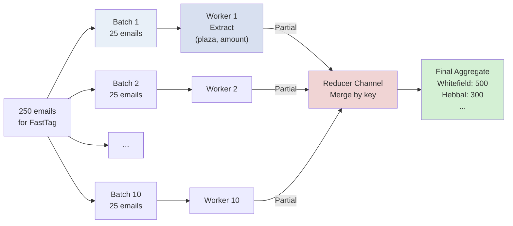

**Key Insight: Streaming Combiner Pattern**

Instead of accumulating all raw rows, each worker **pre-aggregates its batch**:
```
Worker output:  {key: {count, sum}, ...}  ← Only aggregated
NOT:            [{email1}, {email2}, ...]  ← Raw rows (bloat)
```

Reducer merges partials as they arrive:
```
left  = {Whitefield: {count: 2, sum: 100}}
right = {Whitefield: {count: 1, sum: 50}, Hebbal: {count: 2, sum: 200}}
merged= {Whitefield: {count: 3, sum: 150}, Hebbal: {count: 2, sum: 200}}
```

**Result:** Final LLM call in Summarizer sees only the **merged table** (~29 rows), not 250 emails.

---

## Planner Prompt Strategy

The Planner succeeds by combining three context sources:

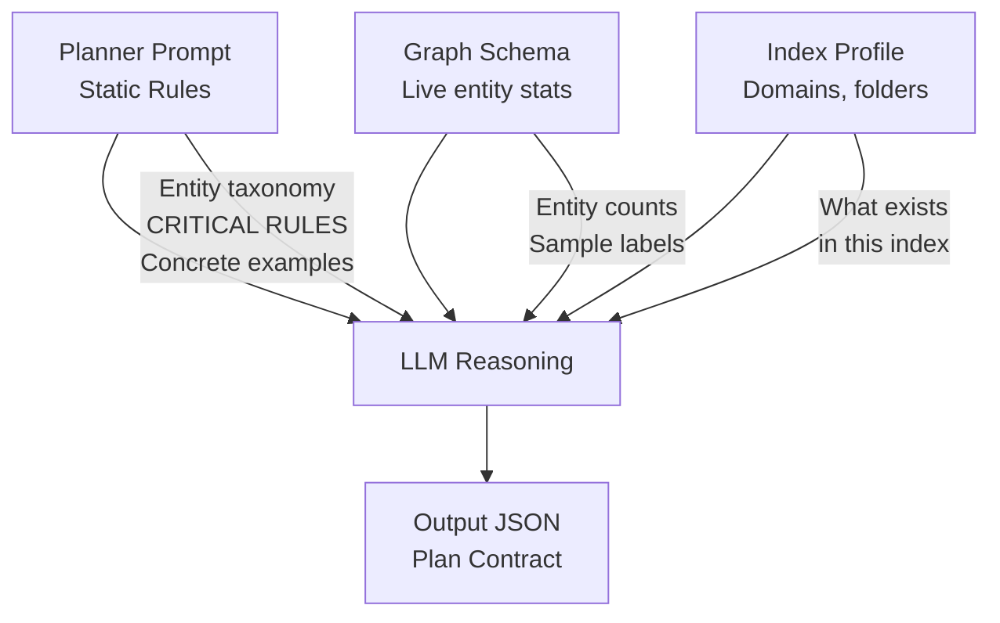

**Static Prompt Includes:**
- Entity type taxonomy (8 types with descriptions)
- Critical rules (measure format, keyword guidance, enum values)
- Concrete JSON examples showing exact output format

**Dynamic Context Injected:**
```
Graph Schema:
  ORG: 145 nodes [ICICI Bank, Amazon, Netflix, ...]
  PLACE: 42 nodes [Toll Plazas (Pan India), Whitefield Plaza, ...]
  AMOUNT: 1,289 nodes [₹500, ₹1000, ...]
  ...

Index Profile:
  Years: 2020–2025
  Folders: Inbox (5,000), Archive (2,000), Sent (1,500), ...
  Top domains: icicibank.com (500), linkedin.com (450), ...
```

This ensures:
- Planner knows what entity types actually have data (no grouping by empty PERSON for financial emails)
- Planner sees example labels (knows "Toll Plazas (Pan India)" exists, won't hallucinate new ones)
- Planner can validate feasibility (e.g., "can I filter by this year?" → check index profile)

---

## Error Handling & Fallback

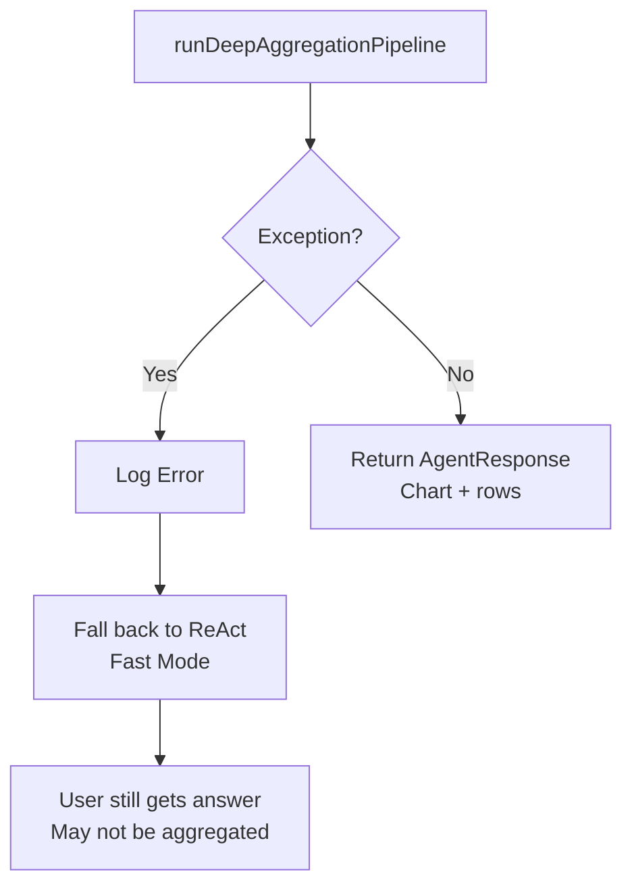

**Common Failure Modes:**

| Failure | Cause | Fallback |
|---------|-------|----------|
| Planner JSON invalid | LLM output malformed | Output normalization (fix case, add defaults) |
| Recall empty | No matching emails | ReAct fallback |
| Workers fail | LLM extraction errors | Log warning, skip batch, continue |
| Schema validation fails | Zod parse error | Output normalization retries |

**Output Normalization** (in Planner):
```typescript
// Fix casing: "Count" → "count", "amount" → "AMOUNT"
// Parse stringified JSON if needed
// Ensure filters/keyword are correct types
// Add sensible defaults (reduce_key_type="PLACE", chart_type="pie_chart")
```

---

## Performance Characteristics

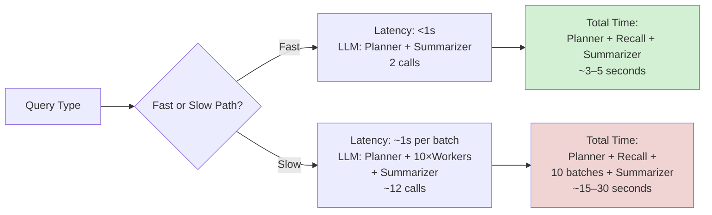

**On Local Ollama:**
- Workers serialize on single model (no parallelism)
- 250 emails @ 25/batch = 10 workers sequentially
- ~1.5–2s per worker → 15–20s total

**On Cloud (GPT-4, Claude 3.5):**
- Workers can parallelize (bounded concurrency)
- 10 workers in parallel → ~3–5s total

---

## Example: "Money Spent at Each Toll Plaza"

Complete trace through the system:

```mermaid
graph TD
    A["User: Pie chart of<br/>toll plaza spending"] --> B["isAggregationQuery?<br/>YES: 'pie chart'"]
    B --> C["DEEP Mode<br/>Aggregation Pipeline"]
    
    C --> D["Planner<br/>question + schema<br/>+ index profile"]
    D --> E["Plan:<br/>reduce_key=PLACE<br/>sum_type=AMOUNT<br/>keyword=FASTag"]
    
    E --> F["Recall<br/>embed + hybrid<br/>+ exhaustive BM25"]
    F --> G["226 hybrid<br/>+ 0 exhaustive<br/>= 226 emails"]
    
    G --> H["Branch<br/>Check path"]
    H --> I{PLACE ≠ AMOUNT?<br/>Cross-entity?}
    I -->|YES| J["Slow Path<br/>Read Content"]
    
    J --> K["9 batches<br/>× 25 emails"]
    K --> L["Worker LLM<br/>Extract<br/>plaza + amount"]
    L --> M["Partials<br/>per batch"]
    
    M --> N["Reducer<br/>Merge all<br/>partials"]
    N --> O["Reduce<br/>Sort & cap<br/>top 20"]
    
    O --> P["Summarizer<br/>Read table<br/>+ write prose"]
    P --> Q["Response:<br/>Pie chart<br/>29 rows<br/>Total: ₹X"]
```

**Logs Generated:**
```
[LangGraph] ▶ Planner: analyzing question "..."
[LangGraph]   ✓ Plan decided: reduce_key=PLACE, measure={sum, sum_type=AMOUNT}
[LangGraph] ▶ Recall: exhaustive search
[LangGraph]   Hybrid search: 226 results
[LangGraph]   Exhaustive keyword search: 0 matches
[LangGraph] ▶ Branch: PLACE vs AMOUNT → Cross-entity → SLOW path
[LangGraph]   Batch 1/9: invoking LLM worker...
[LangGraph]   Batch 1/9: ✓ parsed 8 groups
[LangGraph]   ... (batches 2–9)
[LangGraph] ▶ Reduce: sorting 29 groups, top 20
[LangGraph] ▶ Summarizer: composing answer
[LangGraph] ✓ Pipeline complete: 29 rows
```

---

## Key Design Principles

| Principle | Implementation |
|-----------|-----------------|
| **Privacy First** | No cloud calls, metadata only, optional body indexing |
| **Adaptive Routing** | Fast path when possible, slow path only when needed |
| **Bounded Context** | Batching + pre-aggregation prevents LLM context bloat |
| **Exhaustive Search** | Keyword-triggered BM25 scan ensures no data loss from ANN truncation |
| **Cross-Entity Awareness** | Graph-aware planning prevents false aggregations |
| **Streaming Merge** | Reducer pattern combines partial results without storing all rows |
| **Fallback Resilience** | Deep mode failures fall back to ReAct without losing the query |

---

## References

- `app/src/main/agent/langgraph-agent.ts` — Entry point, mode routing
- `app/src/main/agent/deep-aggregate/graph.ts` — StateGraph nodes & edges
- `app/src/main/agent/deep-aggregate/prompts.ts` — Planner, Worker, Summarizer prompts
- `app/src/main/db/lance-store.ts` — Search implementation (hybrid, exhaustive)
- `app/src/main/db/inboxpie-db.ts` — Graph queries (getNodesForMails, getGraphTypeProfile)
- `app/src/main/agent/graph-extractor.ts` — Entity extraction & entity type taxonomy
