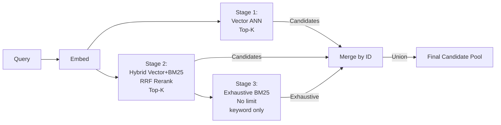
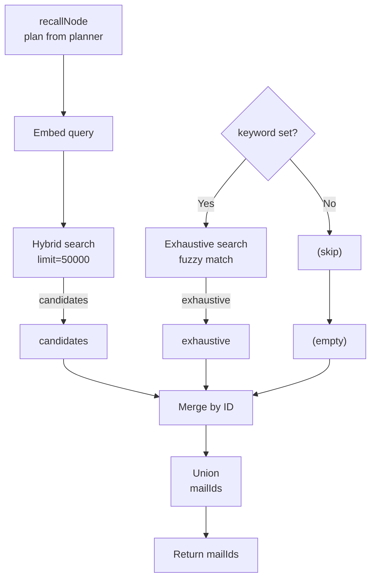
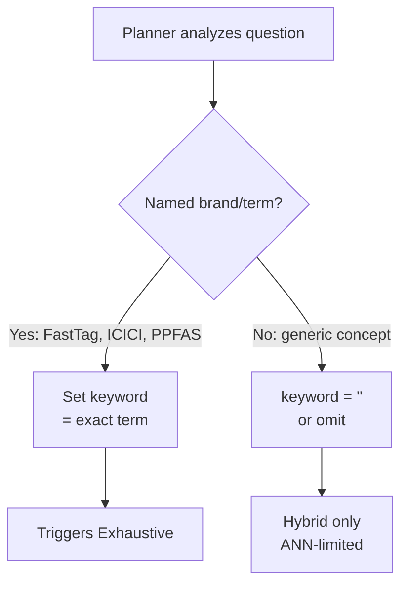
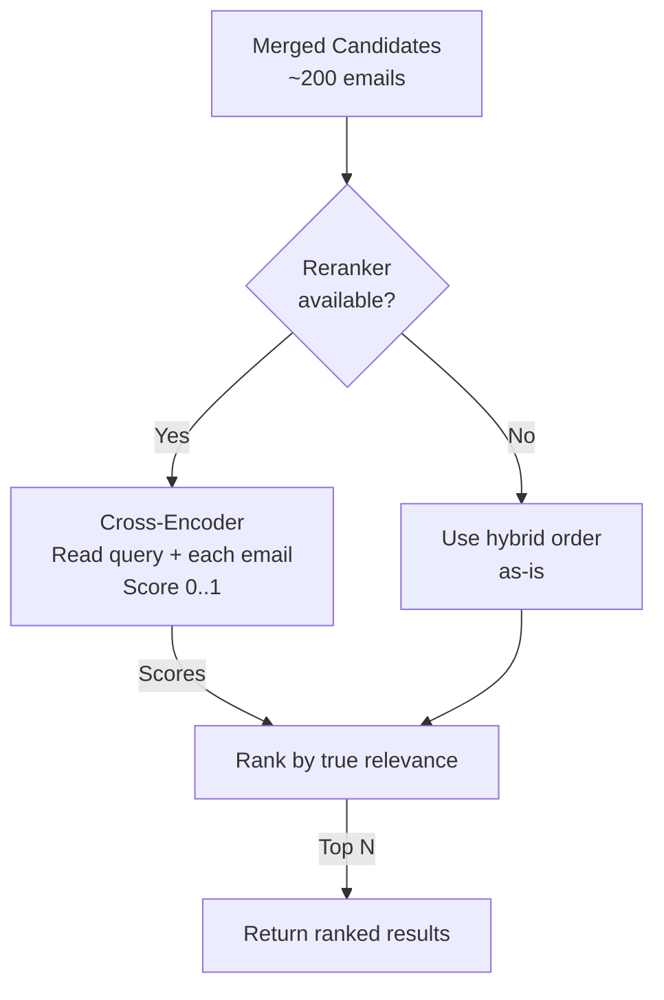
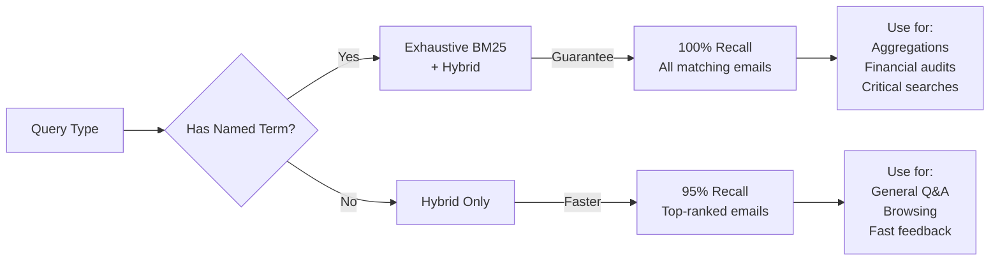

# Search & Recall System

How InboxPie finds emails across vector embeddings, full-text search, and exhaustive keyword matching.

## The Problem

A query like "Find all my FastTag transactions" should return **every email containing FastTag**, not just the top-ranked ones.

However, standard ANN (Approximate Nearest Neighbor) vector search has an implicit top-K limit:
- Query vector compared against all ~50k emails
- Only top-100 by similarity returned
- Emails ranked 101+ silently excluded
- **Even if they contain the exact term searched for**

This is "the 150-of-215 FastTag emails" problem: the index has 215 FastTag emails, but vector search only returns 150 because ANN stopped after top-K.

## Three-Stage Search Pipeline

InboxPie uses three search techniques in parallel, merging results by ID:



### Stage 1: Vector Search (Pure ANN)

**Input:** Query string  
**Process:**
1. Embed query → 768-dim vector
2. LanceDB nearest-to(vector) with cosine distance
3. Return top-K

```typescript
const queryVec = await embedText(query);
const candidates = await lanceStore.search(queryVec, {
  limit: 50000,
  yearFrom, yearTo, folderType, domain,  // Filters
  queryText: query,                        // Enables hybrid in next stage
});
```

**Characteristics:**
- **Fast:** Sub-second for most queries
- **Fuzzy:** Finds semantic matches (e.g., "investment statement" matches "financial reports")
- **Limited:** Only returns top-K; subject to ANN approximation error

**Score:** Cosine distance (0 = identical, 1 = opposite)

---

### Stage 2: Hybrid Search (Vector + BM25 Fused)

**Input:** Query string (same as stage 1) + optional keyword  
**Process:**
1. Same embedding as stage 1
2. Full-text BM25 search over `text_indexed` column
3. Reciprocal Rank Fusion (RRF) combines both rankings
4. Optional: Cross-encoder reranker re-scores fused results

```typescript
// In lanceStore.search()
const useHybrid = !!queryText.trim();
if (useHybrid) {
  q = q.fullTextSearch(queryText).rerank(crossEncoderModel);
}
```

**Characteristics:**
- **Comprehensive:** Vector catches meaning, BM25 catches keywords
- **Ranked:** RRF produces stable merged ranking
- **Reranked:** Cross-encoder verifies true relevance (if available)
- **Still Limited:** Still subject to ANN top-K on the vector leg

**Score:** Relevance score (0–1, higher = more relevant)

---

### Stage 3: Exhaustive BM25 (No ANN Limit)

**Input:** Single keyword term (e.g., "FastTag")  
**Process:**
1. Skip vector search entirely
2. Query LanceDB without `.nearestTo()` (no ANN)
3. Full-text search with fuzzy matching (edit distance ≤ 2)
4. Return ALL matching rows, no limit

```typescript
async searchExhaustive(term: string, opts: { limit?: number } = {}): Promise<SearchResult[]> {
  const fuzzyQuery = new lancedb.MatchQuery(term.trim(), "text_indexed", { fuzziness: 2 });
  const rows = await this.table.query()
    .fullTextSearch(fuzzyQuery)  // ← No .nearestTo() = no ANN = exhaustive
    .limit(opts.limit ?? 50000)
    .toArray();
  return rows;
}
```

**Why Fuzzy Matching?**

Real email text has typos and style variations:
- User searches: "FastTag"
- Email text: "FASTag" (ICICI's official stylization), "Fasttag", "fast tag"
- Exact match BM25: returns 0 rows ✗
- Fuzzy match (distance ≤ 2): returns all 3 ✓

Edit distance ≤ 2 catches:
- Single-character typos: "FastTag" ≈ "FasTag" (1 edit)
- Case variations: "FASTTAG" ≈ "FastTag" (4 edits via case, but case-insensitive matching handles it)
- Misspellings: "FastTag" ≈ "FashTag" (1 edit)

**Characteristics:**
- **Exhaustive:** Every email with the term is found
- **Guaranteed:** No silent data loss
- **Slow:** Full table scan, but still <1s for 50k emails on LanceDB
- **Only if keyword set:** Planner must populate `keyword` field

---

## Recall Node Implementation



**Merge Logic:**
```typescript
const byId = new Map(candidates.map((r) => [r.id, r]));
for (const r of exhaustive) {
  if (!byId.has(r.id)) byId.set(r.id, r);
}
const mailIds = [...byId.keys()];
```

**Result:** All candidates deduplicated, preserving candidate order for scorer ranking.

---

## Planner Guidance: When to Set Keyword

The Planner decides whether to trigger exhaustive search by setting `keyword`:



**When to Set Keyword (Aggregation Queries):**
- ✓ "Pie chart of FastTag transactions" → keyword="FastTag"
- ✓ "Total spent at each ICICI bank" → keyword="ICICI"
- ✓ "Count emails from PPFAS" → keyword="PPFAS"
- ✗ "Investment emails" → keyword="" (too generic)
- ✗ "When did I get paid?" → keyword="" (no specific term)

**Planner Prompt Rule:**
> For aggregation queries, ALWAYS extract the exact brand/service/product name if one exists
> (e.g. "FastTag", "ICICI", "PPFAS"). This triggers exhaustive search that returns EVERY matching
> email, not just the top-ranked ones. Leave empty ONLY for purely conceptual queries with no
> specific term to anchor on. **For named transactions/services, keyword is REQUIRED.**

---

## Reranking System

After candidates and exhaustive results merge, an optional **cross-encoder reranker** verifies true relevance:



**Cross-Encoder Characteristics:**
- Reads query + email body together (unlike embedding-based bi-encoders)
- Slower (~2–5ms per email) but more accurate
- Catches subtle matches/mismatches that vector+BM25 miss

**Example:**
- Query: "investment statements"
- Email subject: "Q4 Earnings Report" (generic, might score high on BM25)
- Email body: "...mutual fund holdings, NAV, units..." (clearly investment-related)
- Cross-encoder: 0.92 (high confidence)
- Bi-encoder: might score lower on subject alone

**Threshold:** Results below 0.35 confidence are flagged (but still returned):
> "12 results scored below confidence bar — use each result's relevance % to judge"

---

## Performance & Limits

| Stage | Limit | Latency | Notes |
|-------|-------|---------|-------|
| Vector ANN | 50,000 | ~50ms | Approximate, may miss rank >50k |
| Hybrid (RRF) | 50,000 | ~200ms | Combines vector + BM25, fused ranking |
| Exhaustive BM25 | 50,000 | ~200ms | Full scan, guaranteed complete if <50k matches |
| Reranker | 500 | ~500ms | Cross-encoder on top results only |
| **Total** | — | **~1s** | Parallel stages, typical flow <1 second |

**When Results Hit Limits:**
- Logs show: ⚠️ "HIT LIMIT (may be more results)"
- UI note: "The search candidate pool was capped at 50,000; if this seems incomplete, call search again with a higher 'limit'."

---

## Filter System

All searches support metadata filters (applied before ranking):

```typescript
interface SearchOptions {
  yearFrom?: number;       // Filter emails from this year onwards
  yearTo?: number;         // Filter emails up to this year
  folderType?: string;     // "inbox", "sent", "trash", "junk", "drafts", "custom"
  folder?: string;         // Specific folder path
  domain?: string;         // Sender domain exact match
  senderEmail?: string;    // Sender email exact match
}
```

**Planner decides filters:**
```
Filters: {}                                    // No filters
Filters: { year_from: 2024, year_to: 2025 }   // Last 2 years
Filters: { domain: "icicibank.com" }          // From ICICI only
Filters: { folder: "Archive" }                // Archive folder only
```

**Index Profile (injected into Planner):**
Planner sees what actually exists so it doesn't hallucinate:
```
Index Profile:
  Years present: 2020–2025
  Folders: Inbox (5000), Archive (2000), Sent (1500), Trash (300)
  Top domains: icicibank.com (500), linkedin.com (450), newsletter.example.com (200)
```

---

## Exhaustive Search vs. Fast Path: Trade-off



**For Aggregation Queries (Deep Mode):**
- We NEED exhaustive search
- Missing 50 out of 250 FastTag emails = wrong pie chart
- Keyword is required to trigger it

**For Interactive Q&A (Fast Mode):**
- Top-100 emails are usually good enough
- User can refine if results look incomplete
- Faster response (no full-table scan)

---

## Search Quality Signals

The LanceDB search result includes metadata for quality assessment:

```typescript
interface SearchResult {
  id: string;
  subject: string;
  sender_email: string;
  domain: string;
  folder: string;
  date_unix: number;
  text_indexed: string;      // Subject + optional body
  score: number;             // 0..1, higher = more relevant
}
```

**Score Interpretation:**
- **Hybrid results:** `_relevance_score` (RRF-fused + reranked)
  - 0.9–1.0: Definite match
  - 0.7–0.9: Strong match
  - 0.5–0.7: Moderate match
  - 0.3–0.5: Weak match (flagged)
  - <0.3: Likely noise (kept but flagged)
  
- **Vector-only results:** `1 - cosine_distance`
  - Cosine distance: 0 = identical, 2 = opposite
  - Converted to 0–1 scale

---

## Troubleshooting Search

**Problem:** "I know this email exists but it's not in the results"

**Diagnosis:**
1. Check if email is indexed: `npm run dev` → Intelligence tab → check scan count
2. Check if keyword set: Look at logs for `keyword` field in Plan
3. Try exhaustive search manually: If possible, set a keyword manually in a new query

**Solution:**
```
Old query: "Show me FastTag transactions"
New query: "Pie chart of FastTag transactions grouped by toll plaza"
          ↑ "pie chart" + "grouped by" triggers aggregation mode
          ↑ "FastTag" likely gets set as keyword automatically
```

**If Still Missing:**
- Email might not be in scanned folder
- Email might match exactly 0 of your search terms
- Body content might not be indexed (if you only indexed metadata)

---

## Implementation Details

### LanceDB Query Builder

```typescript
let q = table.query()
  .nearestTo(vector)           // Vector ANN search
  .distanceType("cosine")       // Cosine distance metric
  .fullTextSearch(queryText)    // BM25 hybrid (if queryText set)
  .rerank(crossEncoderModel)    // Optional reranker
  .where("year >= 2024")        // Metadata filter
  .limit(50000);                // Cap results

const results = await q.toArray();
```

### Fuzzy BM25 Query

```typescript
const fuzzyQuery = new lancedb.MatchQuery(
  "FastTag".trim(),             // Term to search
  "text_indexed",               // Column to search over
  { fuzziness: 2 }              // Edit distance ≤ 2
);

const rows = await table.query()
  .fullTextSearch(fuzzyQuery)   // ← No .nearestTo() = no ANN
  .limit(50000)
  .toArray();
```

### Merging Results

```typescript
const byId = new Map(candidates.map((r) => [r.id, r]));

for (const r of exhaustive) {
  if (!byId.has(r.id)) byId.set(r.id, r);  // Add if new
}

const mailIds = [...byId.keys()];  // Deduplicated union
```

---

## References

- `app/src/main/db/lance-store.ts:search()` — Hybrid search implementation
- `app/src/main/db/lance-store.ts:searchExhaustive()` — Exhaustive BM25
- `app/src/main/agent/deep-aggregate/graph.ts:recallNode()` — Recall orchestration
- [LanceDB Documentation](https://docs.lancedb.com/) — Query builder, FTS, reranking
